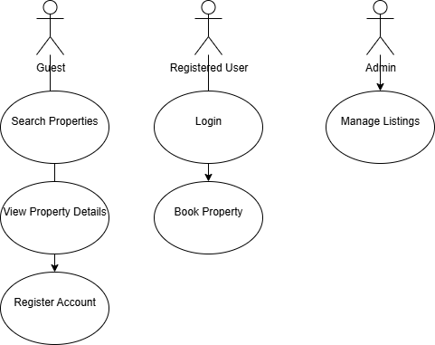

# Requirement Analysis in Software Development

This repository focuses on Requirement Analysis in software development, with a case study on a Booking Management System. It covers key activities, types of requirements, use case diagrams, and acceptance criteria to provide a structured foundation for developing software solutions.
## What is Requirement Analysis?

Requirement Analysis is a critical phase in the Software Development Lifecycle (SDLC) where the project team gathers, analyzes, and defines the requirements of the software product to be developed. This process ensures that all stakeholders have a clear and mutual understanding of what the system should do and how it should perform.

During Requirement Analysis, the team identifies functional and non-functional requirements, clarifies ambiguities, and lays the foundation for designing and developing the system. This step is essential to ensure that the final product aligns with user expectations and business objectives.
## Why is Requirement Analysis Important?

Requirement Analysis is crucial in the SDLC for several reasons:

- **Clarity and Understanding:** It helps in understanding what stakeholders expect from the software, reducing ambiguity and miscommunication.

- **Scope Definition:** Clearly defines the project scope, which helps in preventing scope creep and unplanned work.

- **Basis for Design and Development:** Provides a solid foundation for designing and developing the system effectively.

- **Cost and Time Estimation:** Facilitates accurate estimation of project cost, resources, and timeline.

- **Quality Assurance:** Ensures that the final product meets the specified requirements, leading to higher customer satisfaction.
## Key Activities in Requirement Analysis

Requirement Analysis involves several key activities to ensure the software meets stakeholder expectations:

1. **Requirement Gathering 🗂️**
   - **Interviews:** Conduct interviews with stakeholders to gather detailed information about their needs.
   - **Surveys/Questionnaires:** Collect requirements from a larger audience.
   - **Workshops:** Discuss and gather requirements in collaborative sessions.
   - **Observation:** Observe end-users in their working environment to understand their needs.
   - **Document Analysis:** Review existing documentation and systems to understand current functionalities.

2. **Requirement Elicitation ✍️**
   - **Brainstorming:** Generate ideas and gather requirements in creative sessions.
   - **Focus Groups:** Hold discussions with selected stakeholders to gather detailed requirements.
   - **Prototyping:** Create prototypes to help stakeholders visualize the system and refine their requirements.

3. **Requirement Documentation 📚**
   - **Requirement Specification Document:** Detail all functional and non-functional requirements.
   - **User Stories:** Describe functionalities from the user’s perspective.
   - **Use Cases:** Create diagrams showing interactions between users and the system.

4. **Requirement Analysis and Modeling 📊**
   - **Requirement Prioritization:** Rank requirements based on importance and impact.
   - **Feasibility Analysis:** Assess technical, financial, and time feasibility.
   - **Modeling:** Use models like data flow diagrams or entity-relationship diagrams to visualize requirements.

5. **Requirement Validation ✅**
   - **Review and Approval:** Ensure documented requirements are accurate and complete.
   - **Acceptance Criteria:** Define clear conditions for each requirement.
   - **Traceability:** Use matrices to ensure all requirements are addressed during development and testing.
## Types of Requirements

In Requirement Analysis, requirements are classified into **Functional** and **Non-functional** requirements.

### Functional Requirements ⚙️
Functional requirements describe **what the system should do**. They define the behavior, features, and operations of the system.

**Examples for the Booking Management System:**
- **Search Properties:** Users can search for properties by location, price, and availability.
- **User Registration:** New users can create accounts with personal details and login credentials.
- **Property Listings:** Display property details including images, descriptions, and prices.
- **Booking System:** Users can book properties, view booking details, and manage their bookings.
- **User Authentication:** Secure login and registration process for users.

### Non-functional Requirements 🛡️
Non-functional requirements describe **how the system should perform**. They focus on system attributes like performance, security, usability, and reliability.

**Examples for the Booking Management System:**
- **Performance:** Pages should load within 2 seconds and handle up to 1000 concurrent users.
- **Security:** Data encryption, secure login, and protection against vulnerabilities.
- **Scalability:** Ability to scale horizontally to accommodate increased traffic.
- **Usability:** Intuitive UI/UX, making the application easy to navigate.
- **Reliability:** Uptime of 99.9% with quick recovery from failures.
## Use Case Diagrams 📊

Use Case Diagrams provide a visual representation of interactions between users (actors) and the system.

**What are Use Case Diagrams?**
- Show how different users interact with the system to achieve specific goals (use cases).
- Help identify, organize, and communicate system requirements clearly.

**Benefits:**
- Clear visualization of system functionalities.
- Easier communication between stakeholders and development team.
- Helps in identifying all possible user interactions.

**Example Use Case Diagram for Booking Management System:**

## Acceptance Criteria ✅

Acceptance Criteria are the conditions a feature must meet to be considered complete and accepted by stakeholders. They ensure clarity, quality, and alignment with user expectations.

**Why Acceptance Criteria Matter:**
- Provides a clear understanding of when a feature is “done”.
- Guides developers and testers in implementing and validating features.
- Reduces misunderstandings and scope creep.

**Example for Booking Management System – Checkout Feature:**
- Users can select available dates for a property.
- Users can confirm their booking successfully.
- Users receive a confirmation email within 2 minutes.
- Payment is processed securely and correctly.
- The system updates booking status immediately after confirmation.

These criteria are **specific, measurable, and testable**, ensuring all stakeholders agree on the expected functionality.

